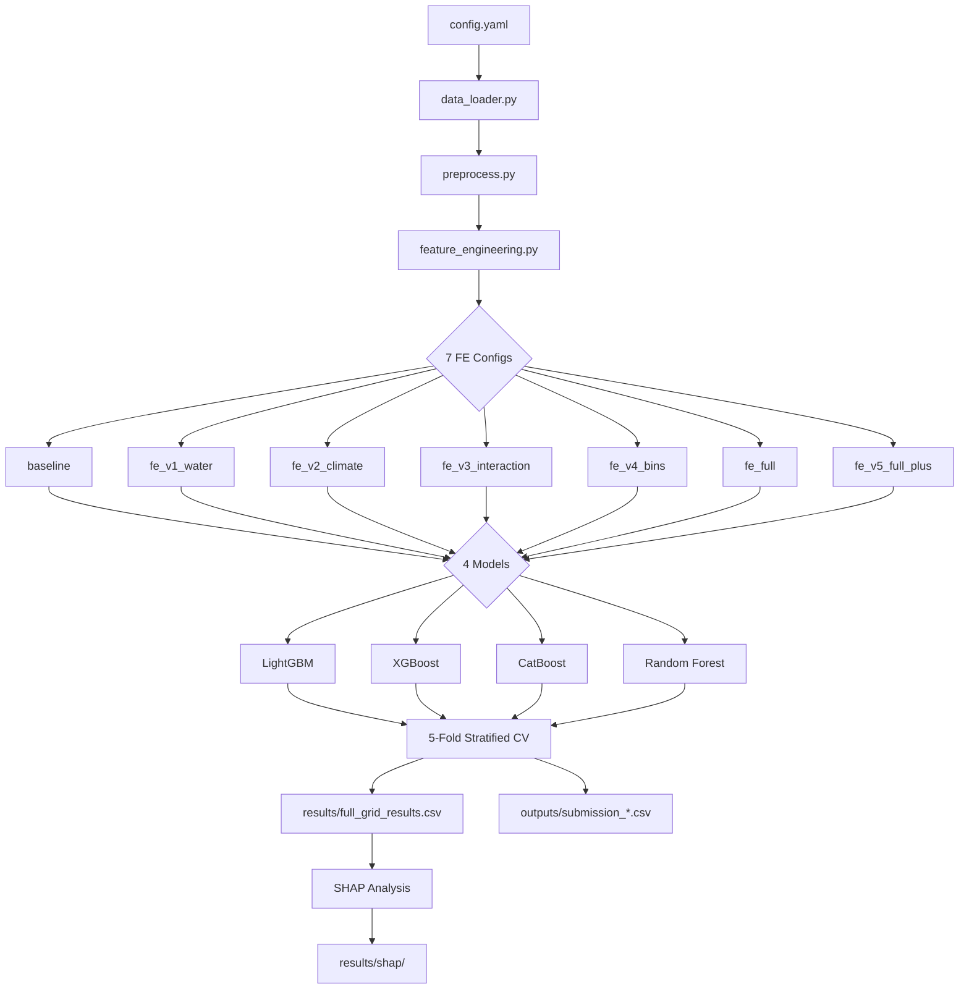

<div align="center">

# 🌱 Irrigation Need Prediction

### Kaggle Playground Series — Season 6, Episode 4

[](https://python.org)
[](https://www.kaggle.com/competitions/playground-series-s6e4)
[](LICENSE)

Dự đoán mức độ tưới tiêu (**Low / Medium / High**) dựa trên các yếu tố khí hậu, đất đai và lịch sử canh tác.  
Bài toán **Multiclass Classification** được xây dựng với pipeline tự động, tái sử dụng cho nhiều cuộc thi Kaggle.

**Best CV Score: `0.96937` (Balanced Accuracy)** — CatBoost + Baseline Features

</div>

---

## 📑 Mục lục

- [Tổng quan](#-tổng-quan)
- [Cấu trúc thư mục](#-cấu-trúc-thư-mục)
- [Cài đặt](#-cài-đặt)
- [Hướng dẫn sử dụng](#-hướng-dẫn-sử-dụng)
- [Pipeline Workflow](#-pipeline-workflow)
- [Feature Engineering](#-feature-engineering)
- [Models](#-models)
- [Kết quả thí nghiệm](#-kết-quả-thí-nghiệm)
- [SHAP Analysis](#-shap-analysis)
- [Decision Tree Visualization](#-decision-tree-visualization)
- [Cấu hình](#️-cấu-hình)
- [Tái sử dụng cho cuộc thi khác](#-tái-sử-dụng-cho-cuộc-thi-khác)

---

## 🎯 Tổng quan

Pipeline tự động hóa toàn bộ quy trình từ **EDA → Feature Engineering → Model Training → Submission**, hỗ trợ:

- 🔄 **Grid Search tự động**: chạy tất cả tổ hợp `FE config × Model` (7 × 4 = 28 experiments)
- 📊 **4 models**: LightGBM, XGBoost, CatBoost, Random Forest (mở rộng thêm Logistic Regression, SVM)
- 🧪 **7 FE configs**: từ baseline đến full feature engineering
- 📈 **SHAP Analysis**: giải thích model bằng SHAP values (bee-swarm, bar, per-class)
- 🌳 **Decision Tree Visualization**: vẽ sơ đồ cây quyết định cho mục đích giải thích
- 📝 **Logging đầy đủ**: CSV log + text log cho mỗi lần chạy

---

## 📁 Cấu trúc thư mục

```
Irrigation-Need-Prediction/
│
├── configs/
│   └── config.yaml                # Cấu hình pipeline (paths, CV, metric, models)
│
├── data/
│   └── raw/
│       ├── train.csv              # Dữ liệu huấn luyện (~80 MB)
│       ├── test.csv               # Dữ liệu kiểm tra (~33 MB)
│       └── sample_submission.csv  # Mẫu submission
│
├── notebooks/
│   ├── EDA_Irrigation_Need.ipynb  # Exploratory Data Analysis (đầy đủ)
│   ├── eda_irrigation.ipynb       # EDA bổ sung
│   ├── solution.ipynb             # Notebook solution (Kaggle submission)
│   └── visualizations/            # Biểu đồ EDA xuất ra (12 files)
│
├── src/
│   ├── data_loader.py             # Load train/test/submission từ config
│   ├── feature_engineering.py     # 7 FE configs + FE_REGISTRY
│   ├── preprocess.py              # Làm sạch dữ liệu + tạo CV folds
│   ├── train.py                   # Baseline comparison + cross-validation
│   ├── model.py                   # 6 models: LightGBM/XGBoost/CatBoost/RF/LR/SVM
│   ├── inference.py               # Tạo submission CSV + ghi experiment log
│   ├── validate.py                # So sánh kết quả FE, chọn config tốt nhất
│   └── shap_analysis.py           # SHAP analysis: TreeExplainer + KernelExplainer
│
├── results/
│   ├── full_grid_results.csv      # Bảng tổng hợp 28 experiments
│   ├── experiment_log.csv         # Log chi tiết theo thời gian
│   ├── shap/                      # SHAP plots (per model × FE config)
│   │   ├── CatBoost_baseline/
│   │   ├── CatBoost_fe_v1_water/
│   │   └── CatBoost_fe_full/
│   └── tree/                      # Decision tree diagrams
│
├── outputs/                       # 28 submission files (Model × FE config)
│
├── main.py                        # Entry point — full grid pipeline + SHAP CLI
├── draw_tree.py                   # Decision Tree visualization script
├── requirements.txt               # Dependencies
├── .gitignore
└── README.md
```

---

## ⚡ Cài đặt

### Yêu cầu

- Python ≥ 3.10
- pip

### Bước 1 — Clone repository

```bash
git clone https://github.com/At-ngo/Irrigation-Need-Prediction.git
cd Irrigation-Need-Prediction
```

### Bước 2 — Cài đặt dependencies

```bash
pip install -r requirements.txt
```

### Bước 3 — Chuẩn bị dữ liệu

Tải dữ liệu từ [Kaggle Competition](https://www.kaggle.com/competitions/playground-series-s6e4/data) và giải nén vào `data/raw/`:

```bash
# Sử dụng Kaggle CLI
kaggle competitions download -c playground-series-s6e4 -p data/raw/
cd data/raw && unzip playground-series-s6e4.zip
```

---

## 🚀 Hướng dẫn sử dụng

### 1. Chạy full pipeline (Grid Search)

```bash
python main.py
```

Pipeline sẽ tự động:
1. Chạy **28 experiments** (7 FE configs × 4 models) với 5-fold Stratified CV
2. Predict test set cho mỗi tổ hợp
3. Xuất 28 submission files vào `outputs/`
4. Lưu bảng tổng hợp vào `results/full_grid_results.csv`
5. Ghi log vào `results/experiment_log.csv` + `results/run_log_*.txt`

### 2. Chạy SHAP Analysis

Sau khi đã chạy pipeline, chọn model và FE config tốt nhất để phân tích:

```bash
# Syntax: python main.py --shap <model_name> <fe_config>
python main.py --shap CatBoost baseline
python main.py --shap CatBoost fe_v1_water
python main.py --shap CatBoost fe_full
```

SHAP plots được lưu tại `results/shap/<model>_<fe_config>/`.

### 3. Vẽ Decision Tree

```bash
# Vẽ 3 FE configs mặc định (baseline, fe_v1_water, fe_full)
python draw_tree.py

# Chỉ vẽ 1 config cụ thể
python draw_tree.py baseline

# Thay đổi độ sâu cây
python draw_tree.py --depth 5
```

---

## 🔄 Pipeline Workflow



---

## 🧪 Feature Engineering

7 FE configs được đăng ký trong `FE_REGISTRY`, pipeline tự động chạy tất cả:

| Config | Features mới | Mô tả |
|--------|:---:|--------|
| `baseline` | 0 | Giữ nguyên features gốc (43 features) |
| `fe_v1_water` | +3 | Water Deficit, Water Supply Index, Irrigation Residual |
| `fe_v2_climate` | +3 | Heat Stress Index, Humidity Deficit, Evapotranspiration Proxy |
| `fe_v3_interaction` | +3 | Rainfall × Moisture, Temp × Humidity, PrevIrrigation × Area |
| `fe_v4_bins` | +4 | Discretize pH, Moisture, Rainfall, Temperature thành bins |
| `fe_full` | +9 | v1 + v2 + v3 (tổng hợp tất cả features liên tục) |
| `fe_v5_full_plus` | +13 | v1 + v2 + v3 + v4 (toàn bộ) |

**Thêm FE config mới:**
1. Định nghĩa hàm trong `src/feature_engineering.py`
2. Đăng ký vào `FE_REGISTRY`
3. Chạy `python main.py` — pipeline tự động bao gồm config mới

---

## 🤖 Models

| Model | Thư viện | Key | Early Stopping | Class Balancing |
|-------|----------|-----|:-:|:-:|
| **LightGBM** | `lightgbm` | `lgbm` | ✅ | `class_weight=balanced` |
| **XGBoost** | `xgboost` | `xgb` | ✅ | — |
| **CatBoost** | `catboost` | `catboost` | ✅ | `auto_class_weights=Balanced` |
| **Random Forest** | `sklearn` | `rf` | — | `class_weight=balanced` |
| **Logistic Regression** | `sklearn` | `lr` | — | `class_weight=balanced` |
| **SVM** | `sklearn` | `svm` | — | `class_weight=balanced` |

> **Note**: LR và SVM sử dụng `StandardScaler` pipeline. Mặc định pipeline chạy 4 models chính (lgbm, xgb, catboost, rf).

Tất cả models sử dụng **5-Fold Stratified Cross-Validation** với metric **Balanced Accuracy**.

---

## 📊 Kết quả thí nghiệm

### Bảng tổng hợp — Top 10 (Balanced Accuracy)

| Rank | Model | FE Config | CV Mean | CV Std | Time (s) | Features |
|:----:|-------|-----------|:-------:|:------:|:--------:|:--------:|
| 🥇 | **CatBoost** | baseline | **0.96937** | 0.00105 | 394 | 43 |
| 🥈 | CatBoost | fe_v1_water | 0.96936 | 0.00088 | 410 | 46 |
| 🥉 | CatBoost | fe_v4_bins | 0.96936 | 0.00080 | 405 | 55 |
| 4 | CatBoost | fe_full | 0.96931 | 0.00087 | 456 | 52 |
| 5 | CatBoost | fe_v5_full_plus | 0.96925 | 0.00092 | 399 | 64 |
| 6 | CatBoost | fe_v2_climate | 0.96916 | 0.00090 | 414 | 46 |
| 7 | CatBoost | fe_v3_interaction | 0.96916 | 0.00088 | 413 | 46 |
| 8 | LightGBM | fe_v5_full_plus | 0.96631 | 0.00104 | 350 | 64 |
| 9 | LightGBM | fe_v1_water | 0.96625 | 0.00096 | 352 | 46 |
| 10 | LightGBM | fe_full | 0.96613 | 0.00079 | 341 | 52 |

### Model Ranking (trung bình trên tất cả FE configs)

| Rank | Model | Avg CV | Nhận xét |
|:----:|-------|:------:|----------|
| 🥇 | **CatBoost** | ~0.969 | Tốt nhất, ổn định nhất |
| 🥈 | LightGBM | ~0.966 | Nhanh, performance tốt |
| 🥉 | Random Forest | ~0.965 | Robust nhưng chậm hơn |
| 4 | XGBoost | ~0.962 | Ổn, thấp hơn LightGBM |

> **Key Insight**: CatBoost vượt trội ở mọi FE config. Thêm features mới không cải thiện đáng kể so với baseline — cho thấy dữ liệu gốc đã đủ thông tin.

---

## 🔍 SHAP Analysis

SHAP (SHapley Additive exPlanations) được sử dụng để giải thích predictions của model:

### Outputs cho mỗi tổ hợp (Model × FE config)

| File | Mô tả |
|------|--------|
| `shap_importance_bar.png` | Mean \|SHAP\| trung bình qua các class |
| `shap_beeswarm_Low.png` | Bee-swarm plot cho class Low |
| `shap_beeswarm_Medium.png` | Bee-swarm plot cho class Medium |
| `shap_beeswarm_High.png` | Bee-swarm plot cho class High |
| `shap_bar_*.png` | Bar plot per class (top 20 features) |
| `shap_feature_importance.csv` | Bảng feature importance dạng CSV |

### Explainer tự động chọn

| Model type | Explainer | Ghi chú |
|------------|-----------|---------|
| LightGBM, XGBoost, RF | `shap.TreeExplainer` | Nhanh, exact |
| CatBoost | Native `get_feature_importance(ShapValues)` | Tiết kiệm RAM |
| LR, SVM | `shap.KernelExplainer` | Sampling-based |

---

## 🌳 Decision Tree Visualization

Script `draw_tree.py` tạo Decision Tree đơn giản để **giải thích logic phân loại** (không dùng để submit):

| Output | Mô tả |
|--------|--------|
| `tree_full_depth4.png` | Sơ đồ cây đầy đủ (high-res) |
| `tree_compact_depth3.png` | Cây rút gọn depth=3 (dễ đọc) |
| `tree_feature_importance.png` | Feature importance (Gini) |
| `tree_rules.txt` | Decision rules dạng text |
| `tree_feature_importance.csv` | Importance dạng CSV |

---

## ⚙️ Cấu hình

Tất cả cấu hình nằm trong `configs/config.yaml`:

```yaml
competition:
  name: "Irrigation-Need"
  task: "multiclass"          # binary | multiclass | regression
  target_col: "Irrigation_Need"
  id_col: "id"

paths:
  train:  "data/raw/train.csv"
  test:   "data/raw/test.csv"
  sub:    "data/raw/sample_submission.csv"
  output: "outputs/"

cv:
  n_folds: 5
  seed: 42
  strategy: "auto"            # auto | stratified | kfold | group

metric: "balanced_accuracy"
# binary:     auc | logloss | f1 | accuracy
# multiclass: logloss | accuracy | f1_macro | balanced_accuracy
# regression: rmse | mae | rmsle | r2

models:
  lgbm:     true
  xgb:      true
  catboost: true
  rf:       true
```

---

## 🔁 Tái sử dụng cho cuộc thi khác

Pipeline thiết kế để **plug-and-play** cho các Kaggle competitions khác:

1. **Thay data**: đặt `train.csv`, `test.csv`, `sample_submission.csv` vào `data/raw/`
2. **Cập nhật config**: sửa `configs/config.yaml` — task, target_col, metric
3. **Thêm FE**: viết hàm FE mới trong `src/feature_engineering.py` + đăng ký vào `FE_REGISTRY`
4. **Chạy**: `python main.py`

---

## 🛠️ Tech Stack

| Thành phần | Công nghệ |
|------------|-----------|
| Data Processing | `pandas`, `numpy` |
| ML Models | `lightgbm`, `xgboost`, `catboost`, `scikit-learn` |
| Explainability | `shap` |
| Visualization | `matplotlib`, `seaborn` |
| Config | `pyyaml` |
| Notebook | `jupyter` |

---

<div align="center">

**Made with ❤️ for Kaggle Playground Series**

</div>